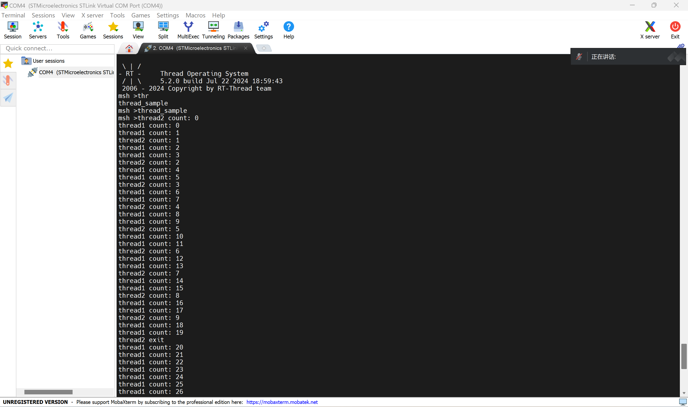

# 2024-RSOC-Day2

## 线程管理

***在日常生活中，我们要完成一个大任务，一般会将它分解成多个简单、容易解决的小问题，小问题逐个被解决，大问题也就随之解决了。在多线程操作系统中，也同样需要开发人员把一个复杂的应用分解成多个小的、可调度的、序列化的程序单元，当合理地划分任务并正确地执行时，这种设计能够让系统满足实时系统的性能及时间的要求。***

## 线程的分类 

***线程分为用户线程和系统线程，系统线程是由 RT-Thread 内核创建的线程，用户线程是由应用程序创建的线程，这两类线程都会从内核对象容器中分配线程对象，当线程被删除时，也会被从对象容器中删除，每个线程都有重要的属性，如线程控制块、线程栈、入口函数等。***
## 线程状态
***1.初始状态：当线程刚开始创建还没开始运行时就处于初始状态；在初始状态下，线程不参与调度。此状态在 RT-Thread 中的宏定义为 RT_THREAD_INIT。***
***2.就绪状态：在就绪状态下，线程按照优先级排队，等待被执行；一旦当前线程运行完毕让出处理器，操作系统会马上寻找最高优先级的就绪态线程运行。此状态在 RT-Thread 中的宏定义为 RT_THREAD_READY。***
***3.运行状态：线程当前正在运行。在单核系统中，只有 rt_thread_self() 函数返回的线程处于运行状态；在多核系统中，可能就不止这一个线程处于运行状态。此状态在 RT-Thread 中的宏定义为 RT_THREAD_RUNNING。***
***4.挂起状态：也称阻塞态。它可能因为资源不可用而挂起等待，或线程主动延时一段时间而挂起。在挂起状态下，线程不参与调度。此状态在 RT-Thread 中的宏定义为 RT_THREAD_SUSPEND。***
***5.关闭状态：当线程运行结束时将处于关闭状态。关闭状态的线程不参与线程的调度。此状态在 RT-Thread 中的宏定义为 RT_THREAD_CLOSE。***
## 线程优先级
***RT-Thread 线程的优先级是表示线程被调度的优先程度。每个线程都具有优先级，线程越重要，赋予的优先级就应越高，线程被调度的可能才会越大。RT-Thread 最大支持 256 个线程优先级 (0~255)，数值越小的优先级越高，0 为最高优先级。在一些资源比较紧张的系统中，可以根据实际情况选择只支持 8 个或 32 个优先级的系统配置；对于 ARM Cortex-M 系列，普遍采用 32 个优先级。最低优先级默认分配给空闲线程使用，用户一般不使用。在系统中，当有比当前线程优先级更高的线程就绪时，当前线程将立刻被换出，高优先级线程抢占处理器运行。***
## 时间片
***每个线程都有时间片这个参数，但时间片仅对优先级相同的就绪态线程有效。系统对优先级相同的就绪态线程采用时间片轮转的调度方式进行调度时，时间片起到约束线程单次运行时长的作用，其单位是一个系统节拍（OS Tick）。假设有 2 个优先级相同的就绪态线程 A 与 B，A 线程的时间片设置为 10，B 线程的时间片设置为 5，那么当系统中不存在比 A 优先级高的就绪态线程时，系统会在 A、B 线程间来回切换执行，并且每次对 A 线程执行 10 个节拍的时长，对 B 线程执行 5 个节拍的时长。***

## 空闲线程
***空闲线程（idle）是系统创建的最低优先级的线程，线程状态永远为就绪态。当系统中无其他就绪线程存在时，调度器将调度到空闲线程，它通常是一个死循环，且永远不能被挂起。***

***若某线程运行完毕，系统将自动删除线程：自动执行 rt_thread_exit() 函数，先将该线程从系统就绪队列中删除，再将该线程的状态更改为关闭状态，不再参与系统调度，然后挂入 僵尸队列（资源未回收、处于关闭状态的线程队列）中，最后空闲线程会回收被删除线程的资源。***

***空闲线程也提供了接口来运行用户设置的钩子函数，在空闲线程运行时会调用该钩子函数，适合处理功耗管理、看门狗喂狗等工作。***

## 主线程
***在系统启动时，系统会创建 main 线程，它的入口函数为 main_thread_entry()，用户的应用入口函数 main() 就是从这里真正开始的，系统调度器启动后，main 线程就开始运行。***

## 线程控制块

```C
/* 线程控制块 */
struct rt_thread
{
    /* rt 对象 */
    char        name[RT_NAME_MAX];     /* 线程名称 */
    rt_uint8_t  type;                   /* 对象类型 */
    rt_uint8_t  flags;                  /* 标志位 */

    rt_list_t   list;                   /* 对象列表 */
    rt_list_t   tlist;                  /* 线程列表 */

    /* 栈指针与入口指针 */
    void       *sp;                      /* 栈指针 */
    void       *entry;                   /* 入口函数指针 */
    void       *parameter;              /* 参数 */
    void       *stack_addr;             /* 栈地址指针 */
    rt_uint32_t stack_size;            /* 栈大小 */

    /* 错误代码 */
    rt_err_t    error;                  /* 线程错误代码 */
    rt_uint8_t  stat;                   /* 线程状态 */

    /* 优先级 */
    rt_uint8_t  current_priority;    /* 当前优先级 */
    rt_uint8_t  init_priority;        /* 初始优先级 */
    rt_uint32_t number_mask;

    ......

    rt_ubase_t  init_tick;               /* 线程初始化计数值 */
    rt_ubase_t  remaining_tick;         /* 线程剩余计数值 */

    struct rt_timer thread_timer;      /* 内置线程定时器 */

    void (*cleanup)(struct rt_thread *tid);  /* 线程退出清除函数 */
    rt_uint32_t user_data;                      /* 用户数据 */
};
```
## 静态创建线程
```C
static char thread2_stack[1024];
static struct rt_thread thread2;
 rt_thread_init(&thread2,
                   "thread2",
                   thread2_entry,
                   RT_NULL,
                   &thread2_stack[0],
                   sizeof(thread2_stack),
                   THREAD_PRIORITY - 1, THREAD_TIMESLICE);
```
## 动态创建线程
```C
static rt_thread_t tid1 = RT_NULL;
tid1 = rt_thread_create("thread1",
                            thread1_entry, RT_NULL,
                            THREAD_STACK_SIZE,
                            THREAD_PRIORITY, THREAD_TIMESLICE);
```
## 线程应用示例
***程序清单：创建、初始化/脱离线程
这个例子会创建两个线程，一个动态线程，一个静态线程。
静态线程在运行完毕后自动被系统脱离，动态线程一直打印计数。***
```C
#include <rtthread.h>

#define THREAD_PRIORITY         25
#define THREAD_STACK_SIZE       512
#define THREAD_TIMESLICE        5


static rt_thread_t tid1 = RT_NULL;

/* 线程1的入口函数 */
static void thread1_entry(void *parameter)
{
    rt_uint32_t count = 0;

    while (1)
    {
        /* 线程1采用低优先级运行，一直打印计数值 */
        rt_kprintf("thread1 count: %d\n", count ++);
        rt_thread_mdelay(500);
    }
}

#ifdef rt_align
rt_align(RT_ALIGN_SIZE)
#else
ALIGN(RT_ALIGN_SIZE)
#endif
static char thread2_stack[1024];
static struct rt_thread thread2;

/* 线程2入口 */
static void thread2_entry(void *param)
{
    rt_uint32_t count = 0;

    /* 线程2拥有较高的优先级，以抢占线程1而获得执行 */
    for (count = 0; count < 10 ; count++)
    {
        /* 线程2打印计数值 */
        rt_kprintf("thread2 count: %d\n", count);
        rt_thread_mdelay(1000);
    }
    rt_kprintf("thread2 exit\n");

    /* 线程2运行结束后也将自动被系统脱离 */
}

/* 线程示例 */
int thread_sample(void)
{
    /* 创建线程1，名称是thread1，入口是thread1_entry*/
    tid1 = rt_thread_create("thread1",
                            thread1_entry, RT_NULL,
                            THREAD_STACK_SIZE,
                            THREAD_PRIORITY, THREAD_TIMESLICE);
#ifdef RT_USING_SMP
    /* 绑定线程到同一个核上，避免启用多核时的输出混乱 */
    rt_thread_control(tid1, RT_THREAD_CTRL_BIND_CPU, (void*)0);
#endif
    /* 如果获得线程控制块，启动这个线程 */
    if (tid1 != RT_NULL)
        rt_thread_startup(tid1);

    /* 初始化线程2，名称是thread2，入口是thread2_entry */
    rt_thread_init(&thread2,
                   "thread2",
                   thread2_entry,
                   RT_NULL,
                   &thread2_stack[0],
                   sizeof(thread2_stack),
                   THREAD_PRIORITY - 1, THREAD_TIMESLICE);
#ifdef RT_USING_SMP
    /* 绑定线程到同一个核上，避免启用多核时的输出混乱 */
    rt_thread_control(&thread2, RT_THREAD_CTRL_BIND_CPU, (void*)0);
#endif
    rt_thread_startup(&thread2);

    return 0;
}

/* 导出到 msh 命令列表中 */
MSH_CMD_EXPORT(thread_sample, thread sample);
```
## 线程应用实例运行结果



​                   


