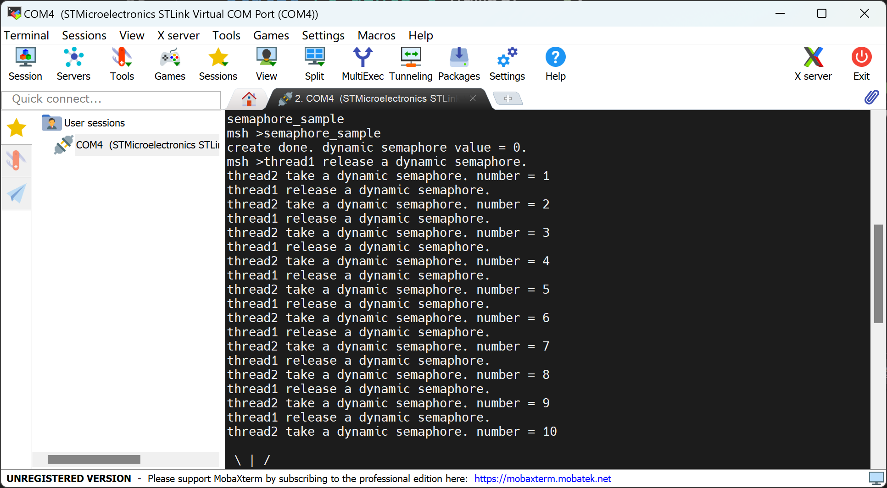
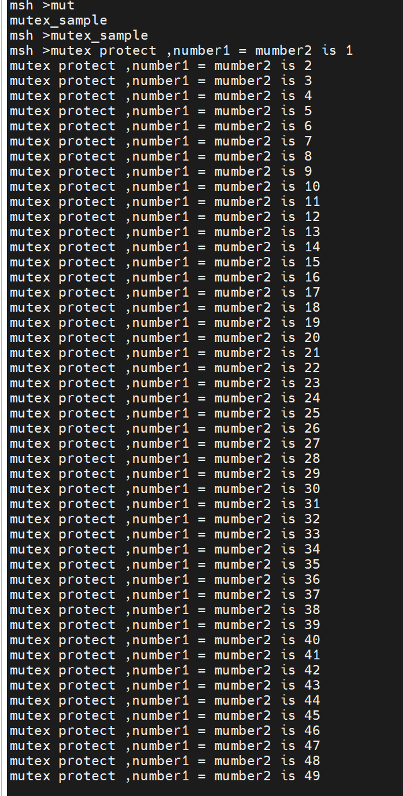

# 线程间同步
**同步是指按预定的先后次序进行运行，线程同步是指多个线程通过特定的机制（如互斥量，事件对象，临界区）来控制线程之间的执行顺序，也可以说是在线程之间通过同步建立起执行顺序的关系，如果没有同步，那线程之间将是无序的。例如一项工作中的两个线程：一个线程从传感器中接收数据并且将数据写到共享内存中，同时另一个线程周期性的从共享内存中读取数据并发送去显示，如果我们对这两个线程不进行任何的处理，那么就会造成显示数据的错乱。线程的同步方式有很多种，其核心思想都是：在访问临界区（多个线程操作 / 访问同一块区域）的时候只允许一个 (或一类) 线程运行。**
## 信号量
**信号量是一种轻型的用于解决线程间同步问题的内核对象，线程可以获取或释放它，从而达到同步或互斥的目的。每个信号量对象都有一个信号量值和一个线程等待队列，信号量的值对应了信号量对象的实例数目、资源数目，假如信号量值为 5，则表示共有 5 个信号量实例（资源）可以被使用，当信号量实例数目为零时，再申请该信号量的线程就会被挂起在该信号量的等待队列上，等待可用的信号量实例（资源）。每被一个线程申请使用后，信号量的值就会减一，减为0后就不能再被线程申请了，除非有其它线程又释放了资源。**
### 信号量控制块
**在 RT-Thread 中，信号量控制块是操作系统用于管理信号量的一个数据结构，由结构体 struct rt_semaphore 表示。另外一种 C 表达方式 rt_sem_t，表示的是信号量的句柄，在 C 语言中的实现是指向信号量控制块的指针。信号量控制块结构的详细定义如下：**
```C
struct rt_semaphore
{
   struct rt_ipc_object parent;  /* 继承自 ipc_object 类 */
   rt_uint16_t value;            /* 信号量的值 */
};
/* rt_sem_t 是指向 semaphore 结构体的指针类型 */
typedef struct rt_semaphore* rt_sem_t;
```
**rt_semaphore 对象从 rt_ipc_object 中派生，由 IPC 容器所管理，信号量的最大值是 65535。**
### 动态创建信号量
```C
 rt_sem_t rt_sem_create(const char *name,
                        rt_uint32_t value,
                        rt_uint8_t flag);
```
**在创建信号量指定的参数中，信号量标志参数决定了当信号量不可用时，多个线程等待的排队方式。当选择 RT_IPC_FLAG_FIFO（先进先出）方式时，那么等待线程队列将按照先进先出的方式排队，先进入的线程将先获得等待的信号量；当选择 RT_IPC_FLAG_PRIO（优先级等待）方式时，等待线程队列将按照优先级进行排队，优先级高的等待线程将先获得等待的信号量。**
### 删除信号量
```C
rt_err_t rt_sem_delete(rt_sem_t sem);
```
***该函数适用于删除动态创建的信号量***
### 初始化(静态创建)信号量
**对于静态信号量对象，它的内存空间在编译时期就被编译器分配出来，放在读写数据段或未初始化数据段上，此时使用信号量就不再需要使用 rt_sem_create 接口来创建它，而只需在使用前对它进行初始化即可。初始化信号量对象可使用下面的函数接口：**
```C
rt_err_t rt_sem_init(rt_sem_t       sem,
                    const char     *name,
                    rt_uint32_t    value,
                    rt_uint8_t     flag)
```
***第一个参数sem是信号量对象的句柄。***
### 脱离信号量
```C
rt_err_t rt_sem_detach(rt_sem_t sem);
```
***使用该函数后，内核先唤醒所有挂在该信号量等待队列上的线程，然后将该信号量从内核对象管理器中脱离。原来挂起在信号量上的等待线程将获得 - RT_ERROR 的返回值。下表描述了该函数的输入参数与返回值：***
### 获取信号量
**线程通过获取信号量来获得信号量资源实例，当信号量值大于零时，线程将获得信号量，并且相应的信号量值会减 1，获取信号量使用下面的函数接口:**
```C
rt_err_t rt_sem_take (rt_sem_t sem, rt_int32_t time);
```
**在调用这个函数时，如果信号量的值等于零，那么说明当前信号量资源实例不可用，申请该信号量的线程将根据 time 参数的情况选择直接返回、或挂起等待一段时间、或永久等待，直到其他线程或中断释放该信号量。如果在参数 time 指定的时间内依然得不到信号量，线程将超时返回，返回值是 - RT_ETIMEOUT。**
***第二个参数time是指定的等待时间，单位是操作系统时钟节拍（OS Tick）***
### 无等待获取信号量
```C
rt_err_t rt_sem_trytake(rt_sem_t sem);
```
### 释放信号量
```C
rt_err_t rt_sem_release(rt_sem_t sem);
```
***例如当信号量的值等于零时，并且有线程等待这个信号量时，释放信号量将唤醒等待在该信号量线程队列中的第一个线程，由它获取信号量；否则将把信号量的值加 1。***

### 信号量应用示例
```C
/*
 * 程序清单：信号量例程
 *
 * 该例程创建了一个动态信号量，初始化两个线程，线程1在count每计数10次时，
 * 发送一个信号量，线程2在接收信号量后，对number进行加1操作
 */
#include <rtthread.h>

#define THREAD_PRIORITY         25
#define THREAD_TIMESLICE        5

/* 指向信号量的指针 */
static rt_sem_t dynamic_sem = RT_NULL;

#ifdef rt_align
rt_align(RT_ALIGN_SIZE)
#else
ALIGN(RT_ALIGN_SIZE)
#endif
static char thread1_stack[1024];
static struct rt_thread thread1;
static void rt_thread1_entry(void *parameter)
{
    static rt_uint8_t count = 0;

    while (1)
    {
        if (count <= 100)
        {
            count++;
        }
        else
            return;

        /* count每计数10次，就释放一次信号量 */
        if (0 == (count % 10))
        {
            rt_kprintf("thread1 release a dynamic semaphore.\n");
            rt_sem_release(dynamic_sem);
        }
    }
}

#ifdef rt_align
rt_align(RT_ALIGN_SIZE)
#else
ALIGN(RT_ALIGN_SIZE)
#endif
static char thread2_stack[1024];
static struct rt_thread thread2;
static void rt_thread2_entry(void *parameter)
{
    static rt_err_t result;
    static rt_uint8_t number = 0;
    while (1)
    {
        /* 永久方式等待信号量，获取到信号量，则执行number自加的操作 */
        result = rt_sem_take(dynamic_sem, RT_WAITING_FOREVER);
        if (result != RT_EOK)
        {
            rt_kprintf("thread2 take a dynamic semaphore, failed.\n");
            rt_sem_delete(dynamic_sem);
            return;
        }
        else
        {
            number++;
            rt_kprintf("thread2 take a dynamic semaphore. number = %d\n", number);
        }
    }
}

/* 信号量示例的初始化 */
int semaphore_sample()
{
    /* 创建一个动态信号量，初始值是0 */
    dynamic_sem = rt_sem_create("dsem", 0, RT_IPC_FLAG_PRIO);
    if (dynamic_sem == RT_NULL)
    {
        rt_kprintf("create dynamic semaphore failed.\n");
        return -1;
    }
    else
    {
        rt_kprintf("create done. dynamic semaphore value = 0.\n");
    }

    rt_thread_init(&thread1,
                   "thread1",
                   rt_thread1_entry,
                   RT_NULL,
                   &thread1_stack[0],
                   sizeof(thread1_stack),
                   THREAD_PRIORITY, THREAD_TIMESLICE);
#ifdef RT_USING_SMP
    /* 绑定线程到同一个核上，避免启用多核时的输出混乱 */
    rt_thread_control(&thread1, RT_THREAD_CTRL_BIND_CPU, (void*)0);
#endif
    rt_thread_startup(&thread1);

    rt_thread_init(&thread2,
                   "thread2",
                   rt_thread2_entry,
                   RT_NULL,
                   &thread2_stack[0],
                   sizeof(thread2_stack),
                   THREAD_PRIORITY - 1, THREAD_TIMESLICE);
#ifdef RT_USING_SMP
    /* 绑定线程到同一个核上，避免启用多核时的输出混乱 */
    rt_thread_control(&thread2, RT_THREAD_CTRL_BIND_CPU, (void*)0);
#endif
    rt_thread_startup(&thread2);

    return 0;
}

/* 导出到 msh 命令列表中 */
MSH_CMD_EXPORT(semaphore_sample, semaphore sample);
```
### 信号量例程的运行结果


---
## 互斥量
**互斥量又叫相互排斥的信号量，是一种特殊的二值信号量。互斥量类似于只有一个车位的停车场：当有一辆车进入的时候，将停车场大门锁住，其他车辆在外面等候。当里面的车出来时，将停车场大门打开，下一辆车才可以进入。**
### 互斥量工作机制
**互斥量的状态只有两种，开锁或闭锁（两种状态值）。当有线程持有它时，互斥量处于闭锁状态，由这个线程获得它的所有权。相反，当这个线程释放它时，将对互斥量进行开锁，失去它的所有权。当一个线程持有互斥量时，其他线程将不能够对它进行开锁或持有它，持有该互斥量的线程也能够再次获得这个锁而不被挂起**
### 互斥量控制块
```C
struct rt_mutex
    {
        struct rt_ipc_object parent;                /* 继承自 ipc_object 类 */

        rt_uint16_t          value;                   /* 互斥量的值 */
        rt_uint8_t           original_priority;     /* 持有线程的原始优先级 */
        rt_uint8_t           hold;                     /* 持有线程的持有次数   */
        struct rt_thread    *owner;                 /* 当前拥有互斥量的线程 */
    };
    /* rt_mutext_t 为指向互斥量结构体的指针类型  */
    typedef struct rt_mutex* rt_mutex_t;
```
***rt_mutex 对象从 rt_ipc_object 中派生，由 IPC 容器所管理。***
### 动态创建互斥量
```C
rt_mutex_t rt_mutex_create (const char* name, rt_uint8_t flag);
```
***互斥量的 flag 标志已经作废，无论用户选择 RT_IPC_FLAG_PRIO 还是 RT_IPC_FLAG_FIFO，内核均按照 RT_IPC_FLAG_PRIO 处理。***
### 删除互斥量
```C
rt_err_t rt_mutex_delete (rt_mutex_t mutex);
```
*该函数接口适用于删除动态创建的互斥量，当删除一个互斥量时，所有等待此互斥量的线程都将被唤醒，等待线程获得的返回值是 - RT_ERROR。然后系统将该互斥量从内核对象管理器链表中删除并释放互斥量占用的内存空间。*
### 初始化（静态创建）互斥量
```C
rt_err_t rt_mutex_init (rt_mutex_t mutex, const char* name, rt_uint8_t flag);
```
### 脱离互斥量
```C
rt_err_t rt_mutex_detach (rt_mutex_t mutex);
```
***该函数接口适用于删除静态创建的互斥量***
### 获取互斥量
```C
rt_err_t rt_mutex_take (rt_mutex_t mutex, rt_int32_t time);
```
*如果互斥量没有被其他线程控制，那么申请该互斥量的线程将成功获得该互斥量。如果互斥量已经被当前线程线程控制，则该互斥量的持有计数加 1，当前线程也不会挂起等待。如果互斥量已经被其他线程占有，则当前线程在该互斥量上挂起等待，直到其他线程释放它或者等待时间超过指定的超时时间。*
### 无等待获取互斥量
```C
rt_err_t rt_mutex_trytake(rt_mutex_t mutex);
```
### 释放互斥量
```C
rt_err_t rt_mutex_release(rt_mutex_t mutex);
```
### 互斥量应用示例
```C
/*
 * 程序清单：互斥锁例程
 *
 * 互斥锁是一种保护共享资源的方法。当一个线程拥有互斥锁的时候，
 * 可以保护共享资源不被其他线程破坏。线程1对2个number分别进行加1操作
 * 线程2也会对2个number分别进行加1操作。使用互斥量保证2个number值保持一致
 */
#include <rtthread.h>

#define THREAD_PRIORITY         8
#define THREAD_TIMESLICE        5

/* 指向互斥量的指针 */
static rt_mutex_t dynamic_mutex = RT_NULL;
static rt_uint8_t number1, number2 = 0;

#ifdef rt_align
rt_align(RT_ALIGN_SIZE)
#else
ALIGN(RT_ALIGN_SIZE)
#endif
static char thread1_stack[1024];
static struct rt_thread thread1;
static void rt_thread_entry1(void *parameter)
{
    while (1)
    {
        /* 线程1获取到互斥量后，先后对number1、number2进行加1操作，然后释放互斥量 */
        rt_mutex_take(dynamic_mutex, RT_WAITING_FOREVER);
        number1++;
        rt_thread_mdelay(10);
        number2++;
        rt_mutex_release(dynamic_mutex);
    }
}

#ifdef rt_align
rt_align(RT_ALIGN_SIZE)
#else
ALIGN(RT_ALIGN_SIZE)
#endif
static char thread2_stack[1024];
static struct rt_thread thread2;
static void rt_thread_entry2(void *parameter)
{
    while (1)
    {
        /* 线程2获取到互斥量后，检查number1、number2的值是否相同，相同则表示mutex起到了锁的作用 */
        rt_mutex_take(dynamic_mutex, RT_WAITING_FOREVER);
        if (number1 != number2)
        {
            rt_kprintf("not protect.number1 = %d, mumber2 = %d \n", number1, number2);
        }
        else
        {
            rt_kprintf("mutex protect ,number1 = mumber2 is %d\n", number1);
        }

        number1++;
        number2++;
        rt_mutex_release(dynamic_mutex);

        if (number1 >= 50)
            return;
    }
}

/* 互斥量示例的初始化 */
int mutex_sample(void)
{
    /* 创建一个动态互斥量 */
    dynamic_mutex = rt_mutex_create("dmutex", RT_IPC_FLAG_PRIO);
    if (dynamic_mutex == RT_NULL)
    {
        rt_kprintf("create dynamic mutex failed.\n");
        return -1;
    }

    rt_thread_init(&thread1,
                   "thread1",
                   rt_thread_entry1,
                   RT_NULL,
                   &thread1_stack[0],
                   sizeof(thread1_stack),
                   THREAD_PRIORITY, THREAD_TIMESLICE);
#ifdef RT_USING_SMP
    /* 绑定线程到同一个核上，避免启用多核时的输出混乱 */
    rt_thread_control(&thread1, RT_THREAD_CTRL_BIND_CPU, (void*)0);
#endif
    rt_thread_startup(&thread1);

    rt_thread_init(&thread2,
                   "thread2",
                   rt_thread_entry2,
                   RT_NULL,
                   &thread2_stack[0],
                   sizeof(thread2_stack),
                   THREAD_PRIORITY - 1, THREAD_TIMESLICE);
#ifdef RT_USING_SMP
    /* 绑定线程到同一个核上，避免启用多核时的输出混乱 */
    rt_thread_control(&thread2, RT_THREAD_CTRL_BIND_CPU, (void*)0);
#endif
    rt_thread_startup(&thread2);
    return 0;
}

/* 导出到 msh 命令列表中 */
MSH_CMD_EXPORT(mutex_sample, mutex sample);
```
### 互斥锁运行结果


---
## 事件集
### 事件集的工作机制
**事件集主要用于线程间的同步，与信号量不同，它的特点是可以实现一对多，多对多的同步。即一个线程与多个事件的关系可设置为：其中任意一个事件唤醒线程，或几个事件都到达后才唤醒线程进行后续的处理；
1.P1 坐公交去某地，只有一种公交可以到达目的地，等到此公交即可出发。
2.P1 坐公交去某地，有 3 种公交都可以到达目的地，等到其中任意一辆即可出发。
3.P1 约另一人 P2 一起去某地，则 P1 必须要等到 “同伴 P2 到达公交站” 与“公交到达公交站”两个条件都满足后，才能出发。**

### 事件集控制块
```C
struct rt_event
{
    struct rt_ipc_object parent;    /* 继承自 ipc_object 类 */

    /* 事件集合，每一 bit 表示 1 个事件，bit 位的值可以标记某事件是否发生 */
    rt_uint32_t set;
};
/* rt_event_t 是指向事件结构体的指针类型  */
typedef struct rt_event* rt_event_t;
```

### 创建和删除事件集
```C
rt_event_t rt_event_create(const char* name, rt_uint8_t flag);
rt_err_t rt_event_delete(rt_event_t event);
```

### 初始化和脱离事件集
```C
rt_err_t rt_event_init(rt_event_t event, const char* name, rt_uint8_t flag);
rt_err_t rt_event_detach(rt_event_t event);
```
### 发送事件
```C
rt_err_t rt_event_send(rt_event_t event, rt_uint32_t set);
```
###  接收事件
```C
rt_err_t rt_event_recv(rt_event_t event,
                           rt_uint32_t set,
                           rt_uint8_t option,
                           rt_int32_t timeout,
                           rt_uint32_t* recved);
```
***内核使用 32 位的无符号整数来标识事件集，它的每一位代表一个事件，因此一个事件集对象可同时等待接收 32 个事件，内核可以通过指定选择参数 “逻辑与” 或“逻辑或”来选择如何激活线程，使用 “逻辑与” 参数表示只有当所有等待的事件都发生时才激活线程，而使用 “逻辑或” 参数则表示只要有一个等待的事件发生就激活线程。***
***option 的值可取：***
```C
/* 选择 逻辑与 或 逻辑或 的方式接收事件 */
RT_EVENT_FLAG_OR
RT_EVENT_FLAG_AND

/* 选择清除重置事件标志位 */
RT_EVENT_FLAG_CLEAR
```

