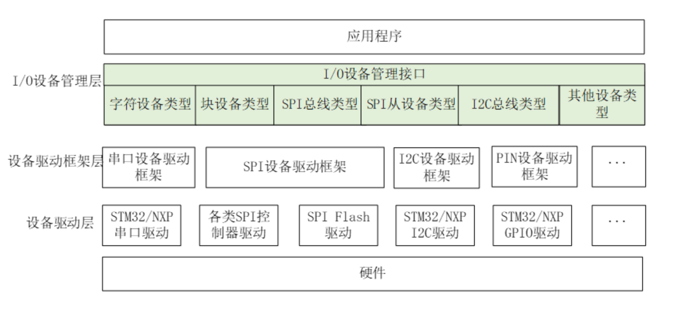
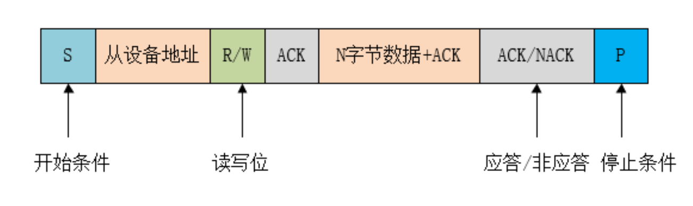
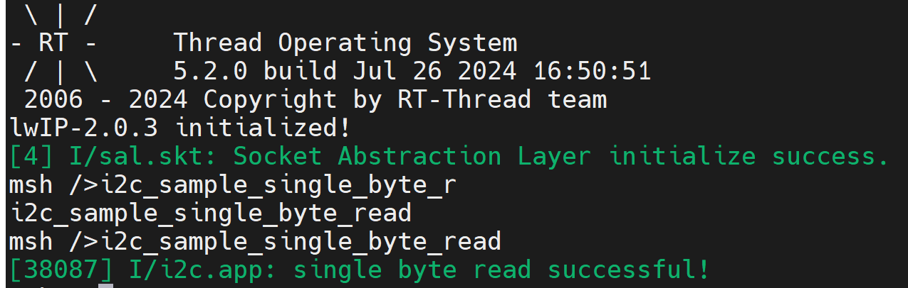
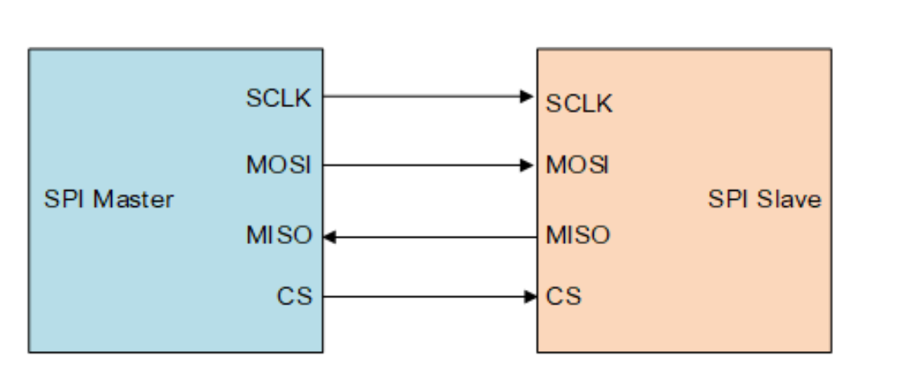
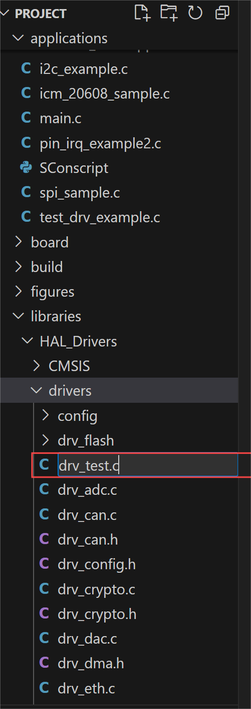
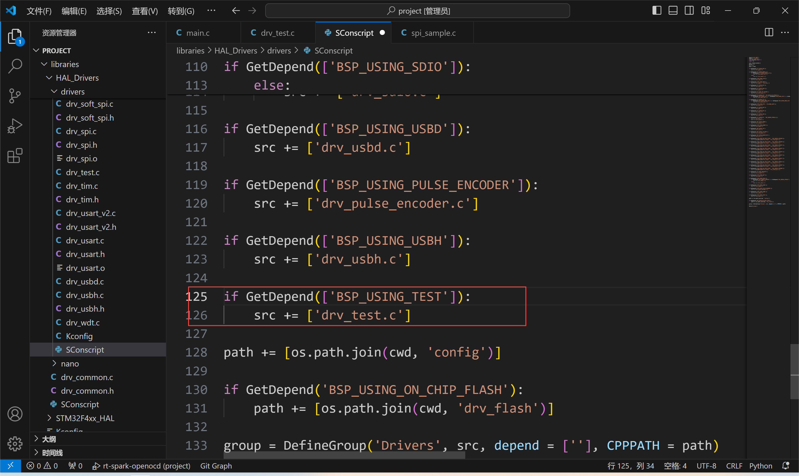
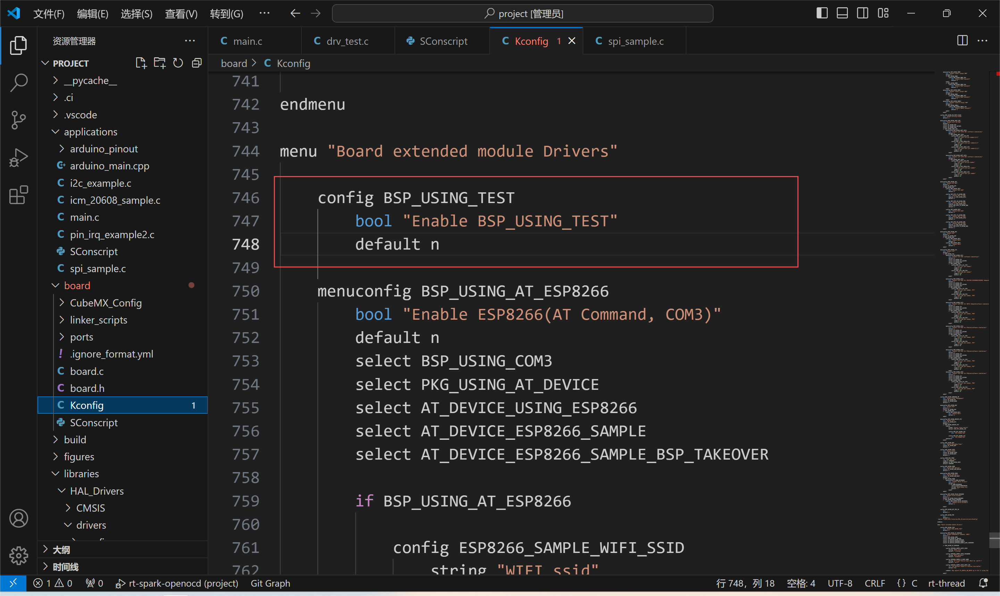
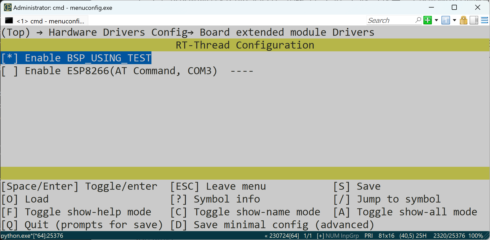

# 设备和驱动
## I/O设备模型框架
**RT-Thread 提供了一套简单的 I/O 设备模型框架，如下图所示，它位于硬件和应用程序之间，共分成三层，从上到下分别是 I/O 设备管理层、设备驱动框架层、设备驱动层。**

*1.I/O 设备管理层实现了对设备驱动程序的封装。应用程序通过图中的"I/O设备管理层"提供的标准接口访问底层设备，设备驱动程序的升级、更替不会对上层应用产生影响。这种方式使得设备的硬件操作相关的代码能够独立于应用程序而存在，双方只需关注各自的功能实现，从而降低了代码的耦合性、复杂性，提高了系统的可靠性。
2.设备驱动框架层是对同类硬件设备驱动的抽象，将不同厂家的同类硬件设备驱动中相同的部分抽取出来，将不同部分留出接口，由驱动程序实现。
3.设备驱动层是一组驱使硬件设备工作的程序，实现访问硬件设备的功能。它负责创建和注册 I/O 设备，对于操作逻辑简单的设备，可以不经过设备驱动框架层，直接将设备注册到 I/O 设备管理器中*
### I/O设备类型
**RT-Thread 支持多种 I/O 设备类型，主要设备类型如下所示：**
```C
RT_Device_Class_Char             /* 字符设备       */
RT_Device_Class_Block            /* 块设备         */
RT_Device_Class_NetIf            /* 网络接口设备    */
RT_Device_Class_MTD              /* 内存设备       */
RT_Device_Class_RTC              /* RTC 设备        */
RT_Device_Class_Sound            /* 声音设备        */
RT_Device_Class_Graphic          /* 图形设备        */
RT_Device_Class_I2CBUS           /* I2C 总线设备     */
RT_Device_Class_USBDevice        /* USB device 设备  */
RT_Device_Class_USBHost          /* USB host 设备   */
RT_Device_Class_SPIBUS           /* SPI 总线设备     */
RT_Device_Class_SPIDevice        /* SPI 设备        */
RT_Device_Class_SDIO             /* SDIO 设备       */
RT_Device_Class_Miscellaneous    /* 杂类设备        */
```
### 创建和注册I/O设备
*驱动层负责创建设备实例，并注册到 I/O 设备管理器中，可以通过静态申明的方式创建设备实例，也可以用下面的接口进行动态创建：*
```C
rt_device_t dev = rt_device_create(int type, int attach_size);
```
*调用该接口时，系统会从动态堆内存中分配一个设备控制块，大小为 struct rt_device 和 attach_size 的和，设备的类型由参数 type 设定。设备被创建后，需要实现它访问硬件的操作方法。*
```C
struct rt_device_ops
{
    /* common device interface */
    rt_err_t  (*init)   (rt_device_t dev);
    rt_err_t  (*open)   (rt_device_t dev, rt_uint16_t oflag);
    rt_err_t  (*close)  (rt_device_t dev);
    rt_size_t (*read)   (rt_device_t dev, rt_off_t pos, void *buffer, rt_size_t size);
    rt_size_t (*write)  (rt_device_t dev, rt_off_t pos, const void *buffer, rt_size_t size);
    rt_err_t  (*control)(rt_device_t dev, int cmd, void *args);
};
```
*当一个动态创建的设备不再需要使用时可以通过如下函数来销毁：*
```C
void rt_device_destroy(rt_device_t device);
```
**设备被创建后，需要注册到 I/O 设备管理器中，应用程序才能够访问，注册设备的函数如下所示：**
```C
rt_err_t rt_device_register(rt_device_t dev, const char* name, rt_uint8_t flags);
```
*flags 参数支持下列参数 (可以采用或的方式支持多种参数)：*
```C
#define RT_DEVICE_FLAG_RDONLY       0x001 /* 只读 */
#define RT_DEVICE_FLAG_WRONLY       0x002 /* 只写  */
#define RT_DEVICE_FLAG_RDWR         0x003 /* 读写  */
#define RT_DEVICE_FLAG_REMOVABLE    0x004 /* 可移除  */
#define RT_DEVICE_FLAG_STANDALONE   0x008 /* 独立   */
#define RT_DEVICE_FLAG_SUSPENDED    0x020 /* 挂起  */
#define RT_DEVICE_FLAG_STREAM       0x040 /* 流模式  */
#define RT_DEVICE_FLAG_INT_RX       0x100 /* 中断接收 */
#define RT_DEVICE_FLAG_DMA_RX       0x200 /* DMA 接收 */
#define RT_DEVICE_FLAG_INT_TX       0x400 /* 中断发送 */
#define RT_DEVICE_FLAG_DMA_TX       0x800 /* DMA 发送 */
```
*设备流模式 RT_DEVICE_FLAG_STREAM 参数用于向串口终端输出字符串：当输出的字符是 “\n” 时，自动在前面补一个 “\r” 做分行。*
**注册成功的设备可以在 FinSH 命令行使用 list_device 命令查看系统中所有的设备信息，包括设备名称、设备类型和设备被打开次数。当设备注销后，设备将从设备管理器中移除，也就不能再通过设备查找搜索到该设备。注销设备不会释放设备控制块占用的内存。注销设备的函数如下所示：**
```C
rt_err_t rt_device_unregister(rt_device_t dev);
```
## I2C总线设备
### I2C总线设备简介
**I2C 总线传输数据（半双工）时只需两根信号线，一根是双向数据线 SDA，另一根是双向时钟线 SCL。I2C总线允许同时有多个主设备存在，每个连接到总线上的器件都有唯一的地址，主设备启动数据传输并产生时钟信号，从设备被主设备寻址，同一时刻只允许有一个主设备。**
***当总线空闲时，SDA 和 SCL 都处于高电平状态，当主机要和某个从机通讯时，会先发送一个开始条件，然后发送从机地址和读写控制位，接下来传输数据（主机发送或者接收数据），数据传输结束时主机会发送停止条件。传输的每个字节为8位，高位在前，低位在后。数据传输过程中的不同名词详解如下所示：***
开始条件： SCL 为高电平时，主机将 SDA 拉低，表示数据传输即将开始。
应答信号：每传输完成一个字节的数据，接收方就需要回复一个 ACK。写数据时由从机发送 ACK，读数据时由主机发送 ACK。当主机读到最后一个字节数据时，可发送 NACK然后跟停止条件。
停止条件：在 SDA 为低电平时，主机将 SCL 拉高并保持高电平，然后在将 SDA 拉高，表示传输结束。
***如下图所示为 I2C 总线主要的数据传输格式：***


### 访问I2C总线设备
***根据 I2C 总线设备名称查找设备获取设备句柄***
```C
rt_device_t rt_device_find(const char* name);
```
### 传输数据
```C
rt_size_t rt_i2c_transfer(struct rt_i2c_bus_device *bus,
                          struct rt_i2c_msg         msgs[],
                          rt_uint32_t               num);
```
*bus  ---  I2C 总线设备句柄
msgs[]  ---  待传输的消息数组指针
num  ---  消息数组的个数*
**I2C 消息数据结构原型如下：**
```C
struct rt_i2c_msg
{
    rt_uint16_t addr;    /* 从机地址 */
    rt_uint16_t flags;   /* 读、写标志等 */
    rt_uint16_t len;     /* 读写数据字节数 */
    rt_uint8_t  *buf;    /* 读写数据缓冲区指针　*/
}
```
### I2C读取一个字节的数据
```C
#include <rtthread.h>
#include <rtdevice.h>

#define LOG_TAG     "i2c.app"
#define LOG_LVL     LOG_LVL_DBG
#include <ulog.h>
void i2c_sample_single_byte_read(void)
{
    struct rt_i2c_bus_device  *i2c_bus;
    struct rt_i2c_msg         msgs[2];
    rt_uint8_t         send_buf[1],recv_buf[1];

    i2c_bus = (struct rt_i2c_bus_device *)rt_device_find("i2c2");
     if(i2c_bus == RT_NULL)
    {
        LOG_E("can't find %s device!\n","i2c2");
    }
    
    send_buf[0] = 0x6B;
    recv_buf[0] = 0x6A;

    msgs[0].addr = 0x68;
    msgs[0].flags = RT_I2C_WR;
    msgs[0].buf = send_buf;
    msgs[0].len = 1;

    msgs[1].addr = 0x68;
    msgs[1].flags = RT_I2C_RD;
    msgs[1].buf = recv_buf;
    msgs[1].len = 1;

    if(rt_i2c_transfer(i2c_bus,&msgs,2) == 2)
    {
        LOG_I("single byte read successful!");
    }
    else
        LOG_E("single byte read failed!");
    
}
MSH_CMD_EXPORT(i2c_sample_single_byte_read,i2c_sample_single_byte_read);
```
### 运行结果

## SPI设备
### SPI简介
**SPI（Serial Peripheral Interface，串行外设接口）是一种高速、全双工、同步通信总线，常用于短距离通讯，主要应用于 EEPROM、FLASH、实时时钟、AD 转换器、还有数字信号处理器和数字信号解码器之间。SPI 一般使用 4 根线通信，如下图所示：**


1. MOSI –主机输出 / 从机输入数据线

2. MISO –主机输入 / 从机输出数据线

3. SCLK –串行时钟线（Serial Clock），主设备输出时钟信号至从设备。

4. CS –从设备选择线 (Chip select)。也叫 SS、CSB、CSN、EN 等，主设备输出片选信号至从设备。

   SPI 以主从方式工作，通常有一个主设备和一个或多个从设备。通信由主设备发起，主设备通过 CS 选择要通信的从设备，然后通过 SCLK 给从设备提供时钟信号，数据通过 MOSI 输出给从设备，同时通过 MISO 接收从设备发送的数据。

## 设计一个新的驱动步骤
### 步骤一
**在drivers目录下新建一个drv_test.c**

### 步骤二
**找到drivers目录下的SConscript文件，对该文件添加如下修改**

### 步骤三
**找到board目录下的Kconfig文件，对该文件添加如下修改**

**在Kconfig文件中修改后，就可以在env工具中找到了**
### 步骤四
**在env工具中将新添加的BSP_USING_TEST使能**

### 步骤五
**编写drv_test.c文件**
```C
#include <rtthread.h>
#include <rtdevice.h>

#if defined(BSP_USING_TEST)

#define DRV_DEBUG
#define LOG_TAG     "drv.test"
#include <drv_log.h>
static rt_err_t dev_test_init(rt_device_t dev)
{
    LOG_T("test dev init");
    return RT_EOK;
}
static rt_err_t dev_test_open(rt_device_t dev,rt_uint16_t oflag)
{
    LOG_I("test dev open flag = %d",oflag);
    return RT_EOK;
}
static rt_err_t dev_test_close(rt_device_t dev)
{
    LOG_I("test dev close");
    return RT_EOK;
}


int rt_device_test_init(void)
{
    rt_device_t test_dev = rt_device_create(RT_Device_Class_Char,0);
    if(!test_dev)
    {
        LOG_E("test_dev create failed!\n");
        return -RT_ERROR;
    }

    test_dev->init = dev_test_init;
    test_dev->open = dev_test_open;
    test_dev->close = dev_test_close;

    if(rt_device_register(test_dev,"test_dev",RT_DEVICE_FLAG_RDWR) != RT_EOK)
    {
        LOG_E("test dev register failed.");
        return -RT_ERROR;
    }
    return RT_EOK;
}
INIT_BOARD_EXPORT(rt_device_test_init);

#endif
```